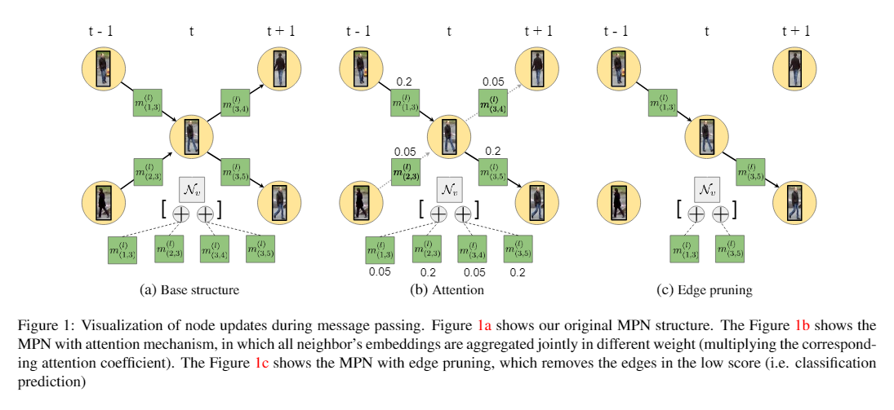

# Learning a Better Neural Network Architecture for Multiple Object Tracking

This implementation is based on the **CVPR 2020 (oral)** paper *Learning a Neural Solver for Multiple Object Tracking* ([Guillem Brasó](https://dvl.in.tum.de/team/braso/), [Laura Leal-Taixe](https://dvl.in.tum.de/team/lealtaixe/))
[[Paper]](https://arxiv.org/abs/1912.07515)[[Youtube]](https://www.youtube.com/watch?v=YWEirYMaLWc)[[CVPR Daily]](https://www.rsipvision.com/ComputerVisionNews-2020July/55/)
The old implementation addreess is [[here]](https://github.com/dvl-tum/mot_neural_solver).

Out 2 mechanism is showed below


## Setup

If you want to look the original setup, please old [[old_README.md]](https://github.com/anslt/ADL4CV/blob/master/old_README.md)

1. Clone and enter this repository:
   ```
   git clone --recursive https://github.com/anslt/ADL4CV.git
   cd mot_neural_solver
   ```
2. (**OPTIONAL**) Download Anaconda if you work on Colab
    ```
    wget -c https://repo.anaconda.com/archive/Anaconda3-2020.11-Linux-x86_64.sh
    chmod +x Anaconda3-2020.11-Linux-x86_64.sh
    bash ./Anaconda3-2020.11-Linux-x86_64.sh -b -f -p /usr/local
    rm Anaconda3-2020.11-Linux-x86_64.sh
    ```
3. Create an [Anaconda environment](https://docs.conda.io/projects/conda/en/latest/user-guide/tasks/manage-environments.html) for this project:
    ```
    conda env create -f environment.yaml
    conda activate mot_neural_solver
    pip install -e tracking_wo_bnw
    pip install -e .
    ```
4. Download the [MOTChallenge data](https://motchallenge.net/), reid network and preprocessed detection:
    ```
    bash scripts/setup/download_motcha.sh
    bash scripts/setup/download_models.sh
    bash scripts/setup/download_prepr_dets.sh
    ```
5. (**OPTIONAL**) Install other lacking package if you work on Colab:
    ```
    conda install -y ipykernel
    ```

## Training
You can train a model by running:
```
python scripts/train.py 
```
By default, sequences `MOT17-04` and `MOT17-11` will be used for validation, and all remaining sequences in the `MOT15`
and `MOT17` datasets will be used for training. You can use other validation sets by
modifying the parameters `data_splits.train` and `data_splits.val`, or use several splits and perform [cross-validation](#Cross-Validation).

In order to train with all available sequences, and reproduce the training of the `MOT17` model we provide, run the following:
```
python scripts/train.py with data_splits.train=all_train train_params.save_every_epoch=True train_params.num_epochs=6
```

For other parameters in training, we introduce below:

graph_model_params: <br />
> time_aware: whether the node updating is time aware (defualt: False) <br />
> network_split: False <br />
> attention: <br />
>>    use_attention: False <br />
    alpha: 0.2 <br />
    attention_head_num: 2 <br />
    att_regu: False <br />
    att_regu_strength: 0.5 <br />
    new_softmax: False <br />
>  dynamical_graph: <br />
>>    first_prune_step: 4 <br />
    graph_pruning: False <br />
    prune_factor: 0.05 <br />
    prune_frequency: 1 <br />
    mode: "classifier node wise" <br />
    prune_min_edge: 5 <br />

 
## Cross-Validation
As explained in the paper, we perform cross-validation to report the metrics of ablation experiments.
To do so, we divide `MOT17` sequences in 3 sets of train/val splits. For every configuration, we then run
3 trainings, one per validation split, and report the overall metrics.

You can train and evaluate models in this manner by running:
```
RUN_ID=your_config_name
python scripts/train.py with run_id=$RUN_ID cross_val_split=1
python scripts/train.py with run_id=$RUN_ID cross_val_split=2
python scripts/train.py with run_id=$RUN_ID cross_val_split=3
python scripts/cross_validation.py with run_id=$RUN_ID
```
By setting `cross_val_split` to 1, 2 or 3, the training and validation sequences corresponding
to the splits we used in the paper will be set automatically (see `src/mot_neural_solver/data/splits.py`).

The last script will gather the stored metrics from each training run, and compute overall `MOT17 metrics` with them.
This will be done by searching output files containing `$RUN_ID` on them, so it's important that this tag is unique.

|           | MOTA         | IDF1           |       FP     |     FN     |     IDs      |     MT              |     ML       |
|  :---:    | :---:        |     :---:      |    :---:     | :---:      |    :---:     |   :---:             |  :---:       |
| **Cross-Val** |     64.3     |     70.5       |    5610      |   114284   |     531      |     643 (39.3%)     |  363  (22.2%)|


